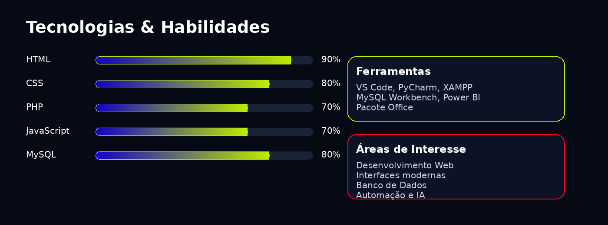

 <h1 align="center">Hello, World! 👋</h1>

  

  

  
  
  

---

  <code>echo "Transformando ideias em projetos reais 🚀";</code>

---

## 👨‍💻 Sobre mim

Sou estudante de **Análise e Desenvolvimento de Sistemas** na **UNICID**, atualmente no **3º semestre**, com previsão de conclusão em **2027**.

Tenho foco em **Desenvolvimento Web**, **Banco de Dados** e criação de projetos que unem organização, usabilidade e solução de problemas.  
Além dos estudos, atuo com **análise documental**, trabalhando diariamente com dados, sistemas e processos.

---

## 🚀 Tecnologias

  

---

## 📊 Tecnologias & Habilidades

  

---

## 📌 Projetos em destaque

### 🌐 Portfólio Pessoal
Site desenvolvido para apresentar meus projetos, habilidades e trajetória na área de tecnologia, com foco em design moderno e responsivo.

🔗 Acesse: https://caetano3009.github.io/portifolio/ 

**Tecnologias:** `HTML` `CSS` `JavaScript`

---

### 💼 Sistema de Vagas de Estágio
Sistema web desenvolvido para divulgação de oportunidades, com foco em organização, praticidade e usabilidade.

**Tecnologias:** `HTML` `CSS` `PHP` `MySQL`

---

### 🦷 Sistema de Clínica Odontológica (Versão Inicial)
Sistema voltado para agendamento e gerenciamento, pensado para facilitar o controle de atendimentos e cadastros.

**Tecnologias:** `PHP` `Bootstrap` `MySQL`

---

### 🏆 SisGESC - Sistema de Gestão de Clínica

Sistema completo de gestão clínica com cadastro de pacientes, profissionais e consultas, desenvolvido com foco em organização e aplicação real de banco de dados.

🔹 Funcionalidades:
- Cadastro de pacientes
- Cadastro de profissionais
- Agendamento de consultas
- Gerenciamento de dados clínicos  

---

### 🌍 RolêFinder
Plataforma criada para encontrar lugares, experiências e roles de forma simples e intuitiva.

**Tecnologias:** `HTML` `CSS` `JavaScript`

---

### 🧠 Fundamentos em C (c-fundamentos-algoritmos)

Repositório com implementações em linguagem C focadas em lógica de programação, estruturas de controle e construção de algoritmos.

🔹 Conteúdos abordados:
- Estruturas condicionais (`if/else`, `switch`)
- Estruturas de repetição (`for`, `while`)
- Vetores e matrizes
- Funções

---

## 🧠 Áreas de conhecimento

  🌐 Desenvolvimento Web • 🗄️ Banco de Dados • 📊 Análise de Dados • 🎨 Interfaces Modernas • ⚙️ Lógica de Programação

---

## 📬 Contato

  
  

---

  

